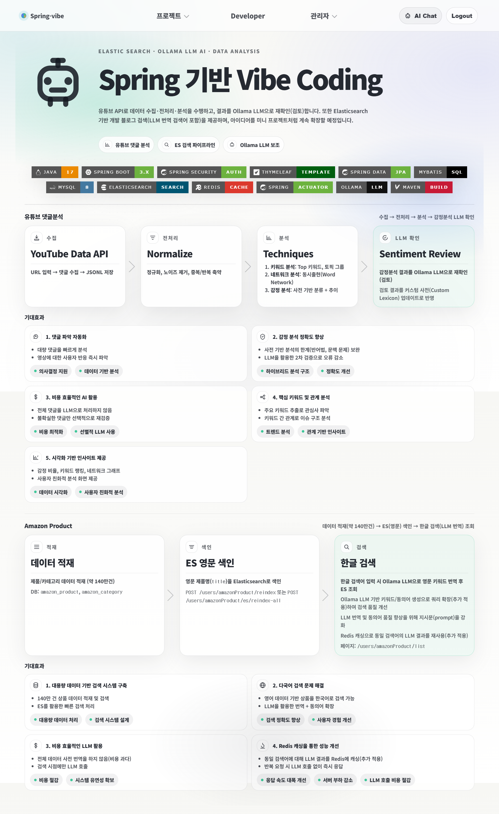

# spring-vibe

<div align="center">
  <h3>Spring 기반 Vibe Coding 프로젝트</h3>
</div>



---

## 1. 변수 정의
이 문서에서 사용되는 플레이스홀더:
- `{{ROOT_PACKAGE}}` = springVibe
- `{{DEVELOP_PACKAGE}}` = dev

---

## 2. 기술 스택
- **Backend**: Java 17, Spring Boot 3.x
- **ORM**: Spring Data JPA (Entity 관리), MyBatis (복잡한 쿼리/통계)
- **Database**: MySQL 8.0+
- **Frontend**: Thymeleaf (legacy UI), React + TypeScript (new menus under `/app/**`), Vite
- **DevOps/Monitoring**: Spring Boot Actuator, Swagger UI (OpenAPI 3)
- (26.04.07) UI 병행 전환: `frontend/`(React+TS, Vite)로 신규 메뉴를 `/app/**`에 개발 (가이드: `docs/etc/FRONTEND_REACT_TS_VITE.md`)
- **빌드 도구**: Maven Wrapper (`mvnw`) 지원

---

## 3. Git 형상관리 정보
- **Repository URL**: `https://github.com/hdh2680/spring-vibe.git`

branch
- master

---

## 4. 프로젝트 구조 및 아키텍처
기능별 도메인 구조(Domain-driven)를 따릅니다.

- `system/`: 인증, 트랜잭션, 보안 등 공통 시스템 설정
- `{{DEVELOP_PACKAGE}}`: 데이터 품질 관리 및 DB 분석 관련 비즈니스 로직
  - `controller/`: REST API 엔드포인트
  - `service/`: 비즈니스 로직 및 트랜잭션 단위
  - `repository/`: JPA 인터페이스
  - `mapper/`: MyBatis SQL 매핑
  - `domain/`: 엔티티(Entity) 및 DTO

**아키텍처 및 패키지 구조**는 `/docs/ARCHITECTURE.md` 참고

---

## 5. 실행 방법

### 5.0 사전 준비
- Java 17 설치
- MySQL 8 실행 및 DB 생성(예시):
```sql
CREATE DATABASE springVibe CHARACTER SET utf8mb4 COLLATE utf8mb4_unicode_ci;
```
- DB 계정 정보 설정:
  - `src/main/resources/application.yml`의 `spring.datasource.username/password` 수정

### 5.1 프로젝트 빌드
```bash
mvn clean install
```
(Maven 미설치 시: `./mvnw clean install` — Windows는 `mvnw.cmd`)

### 5.2 백엔드 실행
```bash
mvn spring-boot:run
```
(Maven 미설치 시: `./mvnw spring-boot:run` — Windows는 `mvnw.cmd`)

### 5.3 Swagger UI 확인
http://localhost:8080/swagger-ui.html  
(또는 http://localhost:8080/swagger-ui/index.html)

### 5.4 Actuator 확인
http://localhost:8080/actuator/health

### 5.5 샘플 페이지
http://localhost:8080/login

### 5.6 Main
http://localhost:8080/

---

## 📚 Docs

기획/구조/규칙/기능은 아래 문서에 정리되어 있습니다.

- [docs/PRD.md](docs/PRD.md): 요구사항(목적, 사용자, 핵심 기능)
- [docs/DATABASE_SCHEMA.md](docs/DATABASE_SCHEMA.md): DB 스키마
- [docs/ARCHITECTURE.md](docs/ARCHITECTURE.md): 아키텍처/패키지 설계
- [docs/CODING_RULE.md](docs/CODING_RULE.md): 코딩 규칙
- [docs/FUNCTIONS.md](docs/FUNCTIONS.md): 구현 기능 목록
- [docs/TODOLIST.md](docs/TODOLIST.md): 작업 목록/진행 상태
- [docs/integrations/youtube-api.md](docs/integrations/youtube-api.md): YouTube API 가이드

---

## 7. AI Work Log Rule
- AI 도움으로 변경한 내용이 있으면, 변경 건마다 작업 노트를 1개 작성한다: `/docs/aiwork/WORK_yyyyMMdd_HHmmss.md`
- 작업 노트에는 다음을 포함한다: 목표(goal), 핵심 변경사항(key changes), 수정/추가한 파일(touched files), 실행/테스트한 명령(run/test commands), 후속 할 일(follow-ups)
- `/docs/aiwork/`에 적재하는 작업 노트 본문은 한국어로 작성한다 (명령어/코드/파일명은 원문 그대로 표기)
- 예외: **HTML/CSS 등 단순 디자인(레이아웃/스타일) 변경만 있는 경우에는 AI Work Log를 남기지 않는다.**
